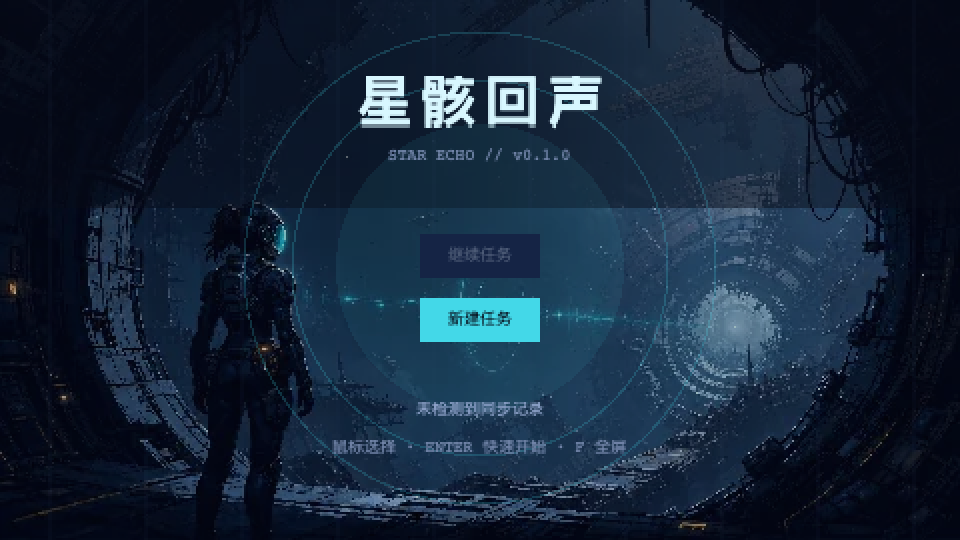
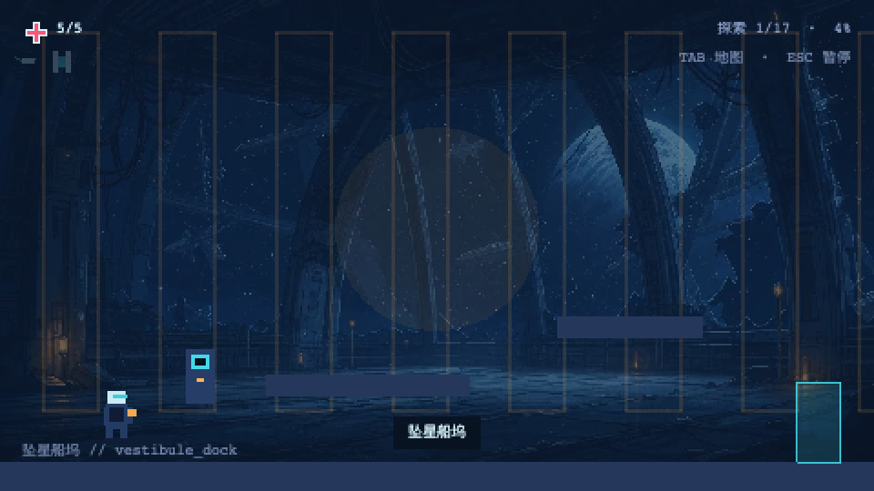
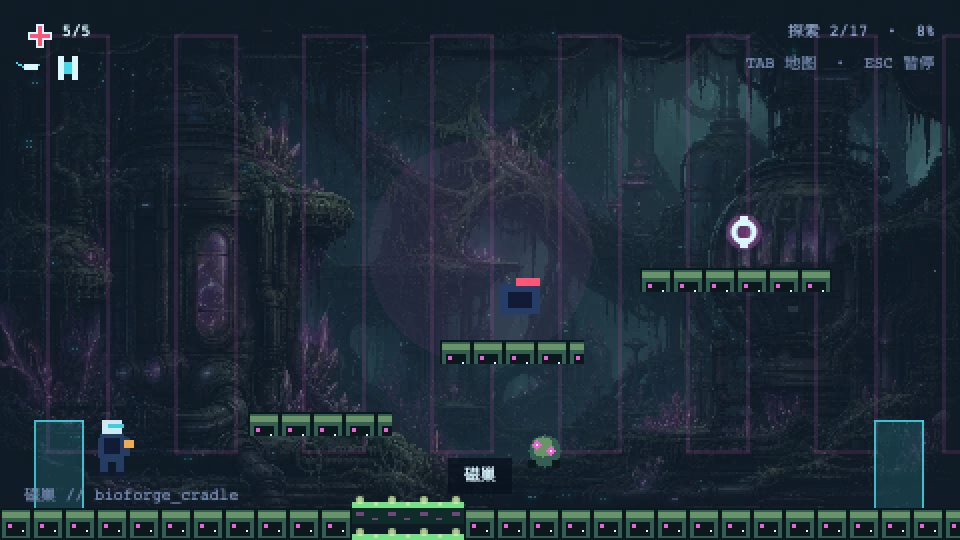
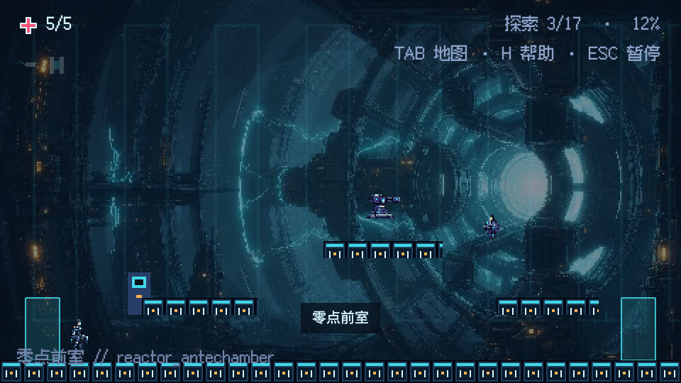
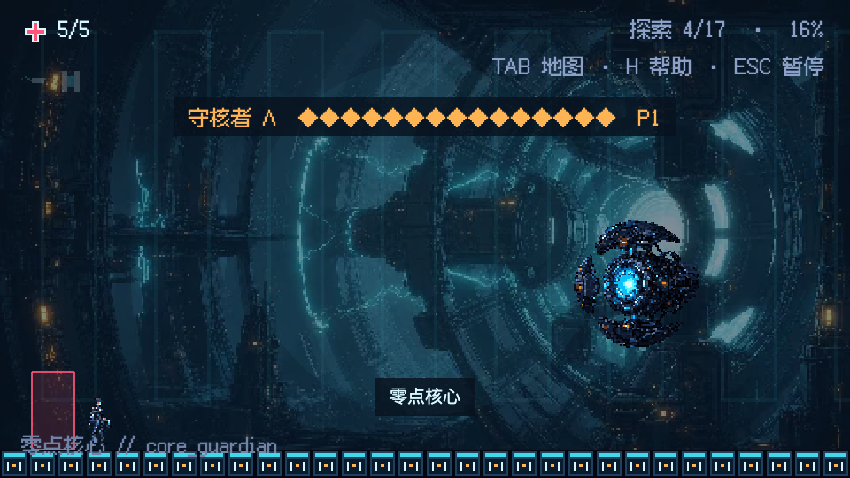
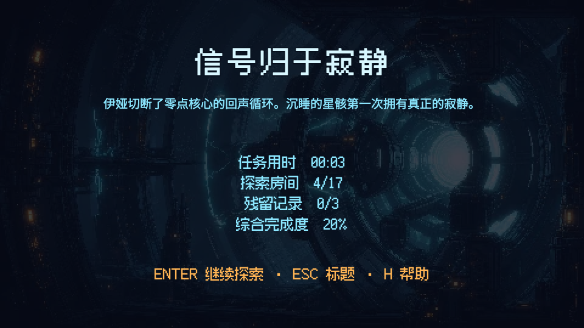

# `v0.1.0` 发布验收记录

验收日期：2026-07-31（Europe/London）

基线环境：macOS、Node.js 24.14.0、pnpm 11.9.0

## 功能范围

- [x] 17 个房间：坠星前庭 6、生化锻造区 6、零点反应堆 4、Boss 房 1。
- [x] 3 个存档终端、2 个隐藏生命升级、3 个环境叙事终端。
- [x] 相位冲刺、磁附跃迁、能力门、中央井捷径和完整回环路线。
- [x] 四类普通敌人；守核者 Λ 为 30 生命、两阶段、三种明确预警招式。
- [x] 标题、继续/新游戏、HUD、地图、暂停、设置、控制说明、结局统计和通关后探索。
- [x] 版本化存档、安全损坏回退、存储拒绝降级和设置独立持久化。
- [x] 键盘、手柄热插拔、失焦暂停/清输入、全屏与程序化 Web Audio 降级。

## 自动验证

- [x] `pnpm install --frozen-lockfile`。
- [x] `pnpm check`：格式、lint、类型检查、13 个 Vitest 文件 / 29 个测试、生产构建和加载预算。
- [x] `pnpm assets:validate`：12 个运行时图像、瓦片接缝、图集尺寸与总量检查。
- [x] `pnpm test:e2e`：Chromium、Firefox、WebKit 各 3 条，共 9 条浏览器旅程。
- [x] 完整路线覆盖：新游戏 → 两项能力 → Boss → 结局 → 继续探索。
- [x] 存档恢复、损坏存档替换、地图、暂停、设置和控制菜单覆盖。
- [x] 菜单帧同步在 Chromium 4 并发下连续重复 10 次通过。
- [x] 生产构建扫描确认不存在 `__STAR_ECHO_TEST__`。

## 性能与资源

- [x] 运行时图像资源 0.15MB / 20MB。
- [x] 生产首屏 1.25MB / 8MB。
- [x] 标题仅预载标题图、主角图集和基础 UI；三个区域按进入顺序懒加载。
- [x] 玩家、敌人和 Boss 投射物使用对象池；房间切换释放临时对象。
- [x] HUD 文本只在值改变时重绘。
- [x] Chromium 960×540 活跃游玩 120 帧采样为 60.03 FPS。

## 视觉基线

以下截图由 Chromium 在 960×540 测试构建中生成，并逐张检查了缺图、裁切、前后景对比、HUD、区域调色、Boss 轮廓与结局排版：

| 标题                              | 坠星前庭                         |
| --------------------------------- | -------------------------------- |
|  |  |

| 生化锻造区                        | 零点反应堆                       |
| --------------------------------- | -------------------------------- |
|  |  |

| 守核者 Λ                | 结局                      |
| ----------------------- | ------------------------- |
|  |  |

Codex 应用内浏览器的本地页连接按规定尝试两次，但本机管理策略无法验证并拒绝访问 `127.0.0.1`；未绕过该安全策略。相同测试构建随后通过项目固定的 Playwright Chromium 会话完成截图、交互和控制台错误验收。这是验收宿主的环境限制，不是游戏运行时错误。

## 发布操作

- [x] 28 个计划主题均保持为可构建的独立提交，不 squash。
- [x] 高分辨率源图由 Git LFS 跟踪，运行时不引用源图目录。
- [ ] 推送前执行 `git fetch origin` 并确认 `origin/main` 没有非快进新历史。
- [ ] 推送 `main` 和 `v0.1.0` 标签后确认 GitHub Actions 绿色。

最后两项属于仓库外部发布操作；完成状态以 Git 远端和 GitHub Actions 为准。
