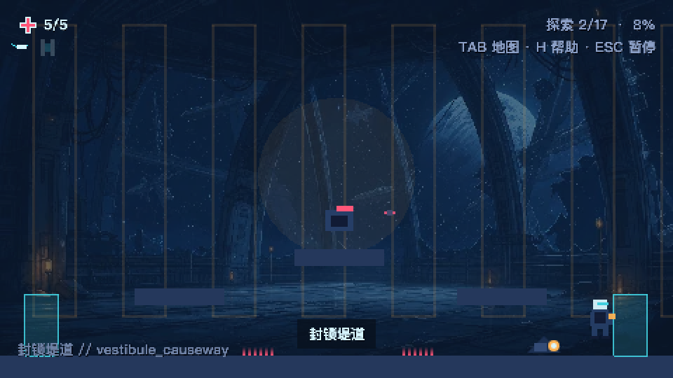
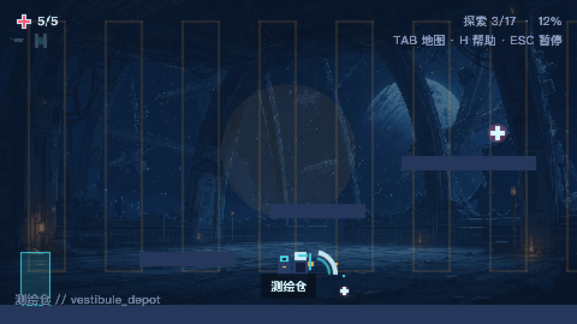
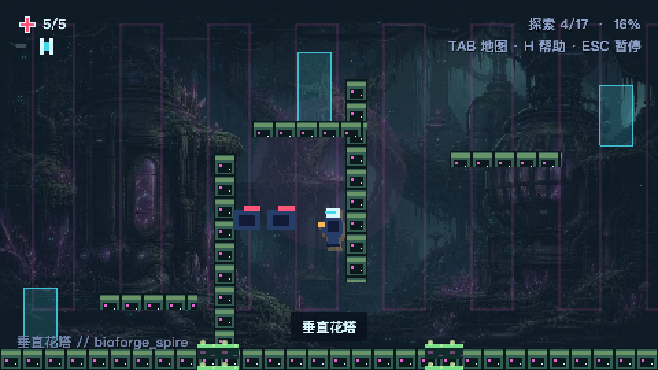

# `v0.2.0` 发布验收记录

验收日期：2026-07-31（Europe/London）

基线环境：macOS、Node.js 24.14.0、pnpm 11.9.0

## 功能范围

- [x] 保留 17 房间完整能力路线、30 生命 Boss、结局及通关后探索。
- [x] `star-echo.save.v1` 结构未变，`v0.1.0` 存档继续兼容。
- [x] 三个指定爬行体使用带盾变体，支持冲刺越心开核、核心侧判定、1.8 秒暴露与 350ms 预警。
- [x] 能量刃在 105ms 判定的前 80ms 反射炮台弹和 Boss 扇形弹。
- [x] 实际墙跳武装首发贯穿弹；落地、死亡、换房和战斗重置均会清除。
- [x] 命中停顿、硬直、击退、局部火花与五项专用程序化音效完整接入辅助设置。
- [x] 九步新手训练、三处会话内提示及键鼠/手柄自适应 Help 页使用正式战斗判定。

## 自动验证

- [x] `pnpm install --frozen-lockfile`。
- [x] `pnpm check`：格式、lint、类型检查、23 个 Vitest 文件 / 59 个测试、生产构建和加载预算。
- [x] `pnpm assets:validate`：运行时图像、瓦片接缝、图集尺寸与 20MB 总量检查。
- [x] `pnpm test:e2e`：Chromium、Firefox、WebKit 共 30 项旅程。
- [x] 12 项融合战斗旅程使用真实输入覆盖盾兵、炮台/Boss 反射、双目标贯穿及生命周期清理。
- [x] 世界验证确认仅三个指定盾兵，17 房间能力图及旧存档路线仍完整可达。
- [x] 生产构建扫描确认不存在 `__STAR_ECHO_TEST__` 或受控战斗场景接口。

## 性能与视觉

- [x] 运行时图像资源 0.15MB / 20MB，生产首屏 1.29MB / 8MB。
- [x] 480×270 检查标题、九步训练、键鼠/手柄 Help、盾牌朝向、核心闪烁、反射弹及贯穿状态，无裁切或文字混淆。
- [x] 960×540 检查三个区域、Boss、战斗特效和结局；像素对齐及最近邻缩放保持正确。
- [x] 暂停、死亡、换房和场景关闭恢复物理倍率并清理投射物、硬直与贯穿武装。

| 960×540 核心暴露                          | 960×540 短窗反射                      | 960×540 贯穿武装                             |
| ----------------------------------------- | ------------------------------------- | -------------------------------------------- |
|  |  |  |

| 480×270 核心暴露                                   | 480×270 短窗反射                               | 480×270 贯穿武装                                      |
| -------------------------------------------------- | ---------------------------------------------- | ----------------------------------------------------- |
|  |  |  |

应用内浏览器的本地页连接按规定尝试，但本机管理策略拒绝访问 `127.0.0.1`；未绕过该策略。视觉和交互复核由仓库固定的 Playwright Chromium 测试构建完成，控制台无错误。该限制属于验收宿主，不是游戏运行时错误。

## 原子提交

`v0.2.0` 使用 11 个按主题划分、各自可构建的提交，不 squash：

1. `refactor(combat): type projectile ownership and hit metadata`
2. `feat(combat): add hit stop knockback and impact feedback`
3. `feat(enemies): add shield crawler counterplay`
4. `feat(combat): reflect hostile projectiles with the energy blade`
5. `feat(ability): add piercing shots after wall jumps`
6. `feat(tutorial): teach combat fusion mechanics`
7. `feat(world): place shield encounters and contextual hints`
8. `feat(ui): document advanced combat techniques`
9. `test: cover shield reflection and piercing journeys`
10. `docs: document v0.2 combat rules and playtest results`
11. `chore(release): prepare v0.2.0`

## 仓库外发布操作

- [ ] 本提交完成后执行 `git fetch origin`，确认 `origin/main` 没有非快进新历史。
- [ ] 推送 `main`，等待 GitHub Actions 的 `check` 与 `browser` 均成功。
- [ ] 在绿色提交上创建并推送注释标签 `v0.2.0`，不 force-push。

以上三项必须发生在本发布提交之后，因此以远端 Git 历史、Actions 记录和标签对象为最终状态来源。`v0.1.0` 的原始验收快照保存在 [`v0.1.0.md`](v0.1.0.md)。
